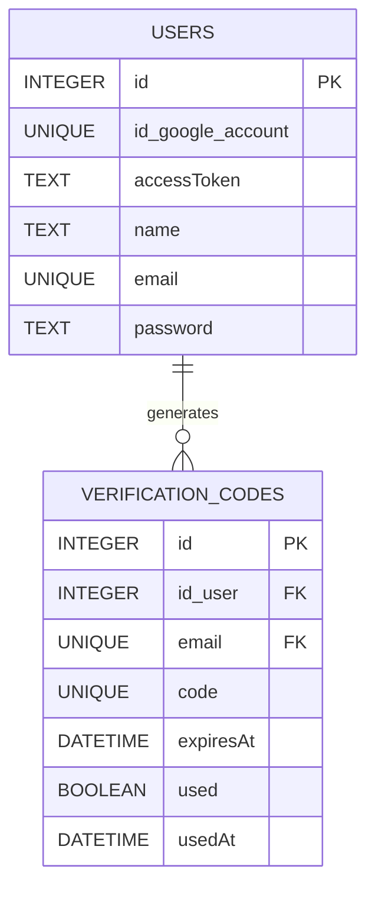

# Google Auth

Este proyecto implementa un sistema de autenticación basado en la API de Google, utilizando tecnologías modernas como TypeScript, Express y SQLite. Permite a los usuarios iniciar sesión con su cuenta de Google y almacena información básica del usuario en una base de datos local.

## 🧩 Stack Tecnológico


## 🧭 Tabla de Contenidos

- [Características](#características)
- [Tecnologías Usadas](#tecnologías-usadas)
- [Estructura del Proyecto](#estructura-del-proyecto)
- [Instalación](#instalación)
- [Uso](##uso)
- [Variables de Entorno](#variables-de-entorno)
- [Métricas](#métricas)
- [Contribuciones](#contribuciones)
- [Licencia](#licensia)

---

## ✨ Características

- ✅ **Inicio de Sesión con Google**: Los usuarios pueden iniciar sesión utilizando su cuenta de Google.
- ✅ **Gestión de Sesiones**: Uso de `express-session` para manejar sesiones de usuario.
- ✅ **Base de Datos Local**: Almacena información del usuario en una base de datos SQLite.
- ✅ **Interfaz de Usuario Simple**: Una interfaz web básica para iniciar y cerrar sesión.
- ✅ **Modo Desarrollo y Producción**: Configuración adaptable según el entorno.

---
## 🛠️ Tecnologías Usadas

### **Backend**
| Herramienta | Descripción |
|--------------|-------------|
| [Node.js](https://nodejs.org/) | Entorno de ejecución |
| [Express](https://expressjs.com/) | Framework para servidor HTTP |
| [TypeScript](https://www.typescriptlang.org/) | Tipado estático y mejor mantenimiento |
| [Google APIs](https://github.com/googleapis/google-api-nodejs-client) | Cliente oficial de Google API |
| [better-sqlite3](https://github.com/WiseLibs/better-sqlite3) | Módulo rápido y sin dependencias |
| [dotenv](https://github.com/motdotla/dotenv) | Gestión de variables de entorno |
| [express-session](https://github.com/expressjs/session) | Manejador de sesiones de usuario |

### **Frontend**
HTML5 · CSS3 · JavaScript (ES6)

### **Dev Tools**
[Nodemon](https://nodemon.io/) · [ts-node](https://github.com/TypeStrong/ts-node)

##  📂 Estructura del Proyecto

```plaintext
.
├── .env                # Variables de entorno
├── .gitignore          # Archivos ignorados por Git
├── nodemon.json        # Configuración de Nodemon
├── package.json        # Dependencias y scripts del proyecto
├── tsconfig.json       # Configuración de TypeScript
├── src/
│   ├── app.ts          # Configuración principal del servidor de Express
│   ├── config.ts       # Configuración de variables de entorno y constantes
│   ├── run.ts          # Punto de entrada de la aplicación
│   ├── auth/
│   │   └── google.ts   # Estrategia de autenticación con Google Passport
│   ├── controller/     # Controladores que manejan la lógica de las peticiones
│   │   ├── authControllers.ts  # Controladores de autenticación
│   │   └── usersControllers.ts # Controladores de usuarios
│   ├── Database/
│   │   ├── db.ts       # Inicialización y conexión a SQLite
│   │   ├── squeme.sql  # Script SQL para creación de tablas
│   │   └── users_auth.db # Archivo de base de datos (generado)
│   ├── models/         # Definiciones de tipos e interfaces TypeScript
│   │   └── types.ts
│   ├── repositories/   # Capa de acceso a datos (Patrón Repository)
│   │   ├── interfaces/ # Interfaces de los repositorios
│   │   └── implementations/ # Implementación concreta de los repositorios
│   ├── routers/        # Definición de las rutas de la API
│   │   ├── authRouters.ts # Rutas de autenticación
│   │   └── userRouters.ts # Rutas de usuarios
│   ├── services/       # Servicios externos y lógica de negocio
│   │   └── emails.ts   # Servicio de envío de correos
│   ├── utils/          # Utilidades y helpers
│   │   └── verifi_password.ts
│   └── public/         # Archivos estáticos
│       ├── index.html
│       ├── auth.html
│       ├── css/
│       │   └── styles.css
│       ├── js/
│       │   └── main.js
│       └── files/
└── README.md           # Documentación del proyecto
```

---

## ⚙️ Instalación

1. **Clona el repositorio**:
   ```bash
   git clone https://github.com/Joel-RD/google_auth.git
   ```

2. **Instala las dependencias**:
   ```bash
   npm install
   ```

3. **Configura las variables de entorno**:
   Crea un archivo `.env` en la raíz del proyecto y configura las siguientes variables (consulta la sección [Variables de Entorno](#variables-de-entorno)).

4. **Ejecuta el proyecto en modo desarrollo**:
   ```bash
   npm run dev
   ```

5. **Accede a la aplicación**:
   Abre tu navegador y ve a [http://localhost:9287](http://localhost:9287).

---

## 📜 Scripts Disponibles

En el directorio del proyecto, puedes ejecutar:

### `npm run dev`
Ejecuta la aplicación en modo desarrollo.\
Utiliza **nodemon** para reiniciar el servidor automáticamente cuando se detectan cambios.

### `npm run build`
Compila la aplicación de TypeScript a JavaScript en la carpeta `dist` y la ejecuta.\
Ideal para verificar que el build de producción funciona correctamente.

---

## 🗄️ Esquema de Base de Datos

El proyecto utiliza **SQLite** con las siguientes tablas:



### Triggers
- **cleanup_old_codes_per_user**: Elimina códigos antiguos del mismo usuario antes de insertar uno nuevo.
- **cleanup_expired_codes**: Elimina códigos expirados globalmente al insertar.
- **cleanup_expired_codes_on_update**: Elimina códigos expirados al actualizar.

---

## 💡 Uso

- **Inicio de Sesión**:
  - Haz clic en el botón "Iniciar sesión con Google".
  - Autoriza la aplicación en la ventana emergente de Google.
  - Serás redirigido a la página principal con tu información de usuario.

- **Cerrar Sesión**:
  - Haz clic en el botón "Cerrar sesión" para finalizar tu sesión.

---

## 🔑 Variables de Entorno

El archivo `.env` debe contener las siguientes variables:

```plaintext
GOOGLE_ID_SECRET=TU_CLIENT_ID_DE_GOOGLE
GOOGLE_SECRET_CLIENT_PASSWORD=TU_CLIENT_SECRET_DE_GOOGLE
REDIRECT_URL=http://localhost:9287/auth/google/callback
TOKEN_AUTHORIZED_SESSION=UNA_CLAVE_SECRETA
PORT=9287
NODE_ENV=development
```

---


## 🪚 Contribuciones

¡Las contribuciones son bienvenidas! Si deseas contribuir:

1. Haz un fork del repositorio.
2. Crea una nueva rama (`git checkout -b feature/nueva-funcionalidad`).
3. Realiza tus cambios y haz commit (`git commit -m 'Agrega nueva funcionalidad'`).
4. Sube tus cambios (`git push origin feature/nueva-funcionalidad`).
5. Abre un Pull Request.

---

## 📚  Licencia

Este proyecto está licenciado bajo la Licencia MIT. Consulta el archivo [LICENSE](LICENSE.txt) para más detalles.